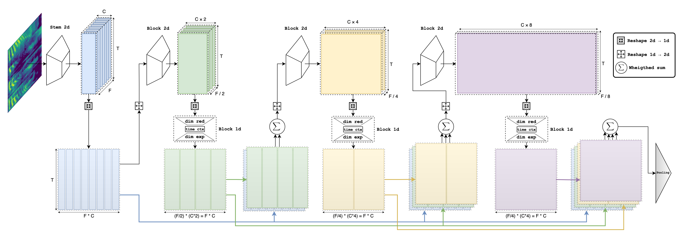

# ReDimNet

This is oficial implementation for neural network architecture presented in paper [Reshape Dimensions Network for Speaker Recognition]().

## Update
* 2024.07.15 Adding model builder and pretrained weights for: `b0`, `b2`, `b3`, `b5`, `b6` model sizes.

## Introduction

We introduce Reshape Dimensions Network (ReDimNet), a novel neural network architecture for spectrogram (audio) processing, specifically for extracting utterance-level speaker representations. ReDimNet reshapes dimensionality between 2D feature maps and 1D signal representations, enabling the integration of 1D and 2D blocks within a single model. This architecture maintains the volume of channel-timestep-frequency outputs across both 1D and 2D blocks, ensuring efficient aggregation of residual feature maps. ReDimNet scales across various model sizes, from 1 to 15 million parameters and 0.5 to 20 GMACs. Our experiments show that ReDimNet achieves state-of-the-art performance in speaker recognition while reducing computational complexity and model size compared to existing systems. 

<p align="center">
	
	<p align="center">
		<em>ReDimNet architecture</em>
	</p>
</p>

## Usage

### Requirement
PyTorch>=2.0
### Examples
```
import torch

# To load pretrained on vox2 model without Large-Margin finetuning
model = torch.hub.load('IDRnD/ReDimNet', 'b0', pretrained=True, finetuned=False)

# To load pretrained on vox2 model with Large-Margin finetuning:
model = torch.hub.load('IDRnD/ReDimNet', 'b0', pretrained=False, finetuned=True)
```