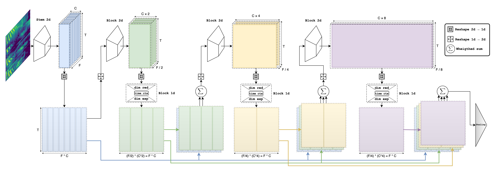

# ReDimNet

This is an official implementation of a neural network architecture presented in the paper [Reshape Dimensions Network for Speaker Recognition](https://arxiv.org/pdf/2407.18223).

<p align="center">
	
	<p align="center">
		<em>Speaker Recognition NN architectures comparison (2024)</em>
	</p>
</p>

## Update
* 2024.07.15 Adding model builder and pretrained weights for: `b0`, `b1`, `b2`, `b3`, `b5`, `b6` model sizes.

## Introduction

We introduce Reshape Dimensions Network (ReDimNet), a novel neural network architecture for spectrogram (audio) processing, specifically for extracting utterance-level speaker representations. ReDimNet reshapes dimensionality between 2D feature maps and 1D signal representations, enabling the integration of 1D and 2D blocks within a single model. This architecture maintains the volume of channel-timestep-frequency outputs across both 1D and 2D blocks, ensuring efficient aggregation of residual feature maps. ReDimNet scales across various model sizes, from 1 to 15 million parameters and 0.5 to 20 GMACs. Our experiments show that ReDimNet achieves state-of-the-art performance in speaker recognition while reducing computational complexity and model size compared to existing systems. 

<p align="center">
	
	<p align="center">
		<em>ReDimNet architecture</em>
	</p>
</p>

## Metrics

| Model | Params | GMACs | LM | AS-Norm | Vox1-O EER(%) | Vox1-E EER(%) | Vox1-H EER(%) |
|-------|--------|-------|----|---------|---------------|---------------|---------------|
| **⬦ ReDimNet-B0** | **1.0M** | **0.43** | ✓ | ✗ | 1.16 | 1.25 | 2.20 |
| **⬥ ReDimNet-B0** | | | ✓ | ✓ | **1.07** | **1.18** | **2.01** |
| NeXt-TDNN-l (C=128,B=3)| 1.6M | 0.29* | ✗ | ✓ | 1.10 | 1.24 | 2.12 |
| NeXt-TDNN (C=128,B=3)| 1.9M | 0.35* | ✗ | ✓ | 1.03 | 1.17 | 1.98 |
| **⬦ ReDimNet-B1** | **2.2M** | **0.54** | ✓ | ✗ | 0.85 | 0.97 | 1.73 |
| **⬥ ReDimNet-B1** | | | ✓ | ✓ | **0.73** | **0.89** | **1.57** |
| ECAPA (C=512) | 6.4M | 1.05 | ✗ | ✓ | 0.94 | 1.21 | 2.20 |
| NeXt-TDNN-l (C=256,B=3)| 6.0M | 1.13* | ✗ | ✓ | 0.81 | 1.04 | 1.86 |
| CAM++ | 7.2M | 1.15 | ✓ | ✗ | 0.71 | 0.85 | 1.66 |
| NeXt-TDNN (C=256,B=3)| 7.1M | 1.35* | ✗ | ✓ | 0.79 | 1.04 | 1.82 |
| **⬦ ReDimNet-B2** | **4.7M** | **0.90** | ✓ | ✗ | 0.57 | 0.76 | 1.32 |
| **⬥ ReDimNet-B2** | | | ✓ | ✓ | **0.52** | **0.74** | **1.27** |
| ECAPA (C=1024) | 14.9M | 2.67 | ✓ | ✗ | 0.98 | 1.13 | 2.09 |
| DF-ResNet56 | 4.5M | 2.66 | ✗ | ✓ | 0.96 | 1.09 | 1.99 |
| Gemini DF-ResNet60 | 4.1M | 2.50* | ✗ | ✓ | 0.94 | 1.05 | 1.80 |
| **⬦ ReDimNet-B3** | **3.0M** | **3.00** | ✓ | ✗ | 0.50 | 0.73 | 1.33 |
| **⬥ ReDimNet-B3** | | | ✓ | ✓ | **0.47** | **0.69** | **1.23** |
| ResNet34 | 6.6M | 4.55 | ✓ | ✗ | 0.82 | 0.93 | 1.68 |
| Gemini DF-ResNet114 | 6.5M | 5.00 | ✗ | ✓ | 0.69 | 0.86 | 1.49 |
| **⬦ ReDimNet-B4** | **6.3M** | **4.80** | ✓ | ✗ | 0.51 | 0.68 | 1.26 |
| **⬥ ReDimNet-B4** | | | ✓ | ✓ | **0.44** | **0.64** | **1.17** |
| Gemini DF-ResNet183 | 9.2M | 8.25 | ✗ | ✓ | 0.60 | 0.81 | 1.44 |
| DF-ResNet233 | 12.3M | 11.17 | ✗ | ✓ | 0.58 | 0.76 | 1.44 |
| **⬦ ReDimNet-B5** | **9.2M** | **9.87** | ✓ | ✗ | 0.43 | 0.61 | 1.08 |
| **⬥ ReDimNet-B5** | | | ✓ | ✓ | **0.39** | **0.59** | **1.05** |
| ResNet293 | 23.8M | 28.10 | ✓ | ✗ | 0.53 | 0.71 | 1.30 |
| ECAPA2 | 27.1M | 187.00* | ✓ | ✗ | 0.44 | 0.62 | 1.15 |
| **⬦ ReDimNet-B6** | **15.0M** | **20.27** | ✓ | ✗ | 0.40 | 0.55 | 1.05 |
| **⬥ ReDimNet-B6** | | | ✓ | ✓ | **0.37** | **0.53** | **1.00** |

\* - means values have been estimated.

## Usage

### Requirement
PyTorch>=2.0
### Examples
```
import torch

# To load pretrained on vox2 model without Large-Margin finetuning
model = torch.hub.load('IDRnD/ReDimNet', 'b0', pretrained=True, finetuned=False)

# To load pretrained on vox2 model with Large-Margin finetuning:
model = torch.hub.load('IDRnD/ReDimNet', 'b0', pretrained=True, finetuned=True)
```

## Citation

If you find this work or code is helpful in your research, please cite (will be updated after Interspeech 2024 publication):
```
@misc{yakovlev2024reshapedimensionsnetworkspeaker,
      title={Reshape Dimensions Network for Speaker Recognition}, 
      author={Ivan Yakovlev and Rostislav Makarov and Andrei Balykin and Pavel Malov and Anton Okhotnikov and Nikita Torgashov},
      year={2024},
      eprint={2407.18223},
      archivePrefix={arXiv},
      primaryClass={eess.AS},
      url={https://arxiv.org/abs/2407.18223}, 
}
```

## Acknowledgements

For training model we used [wespeaker](https://github.com/wenet-e2e/wespeaker/tree/master) pipeline. 
We ported some layers from [transformers](https://github.com/huggingface/transformers).
